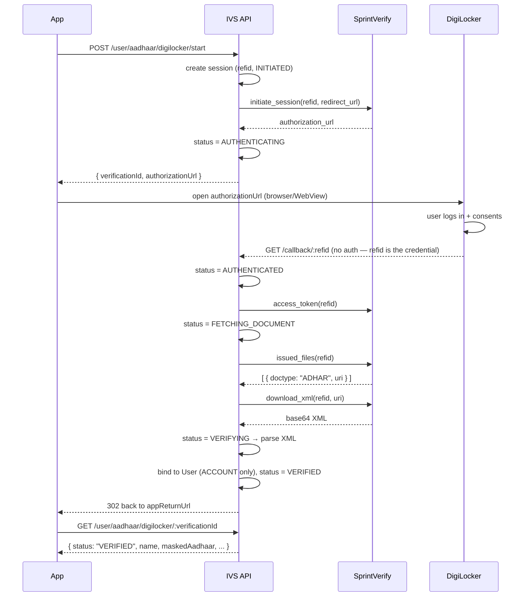

# DigiLocker Aadhaar Verification — Workflow

How a user proves their Aadhaar identity through DigiLocker, end to end.

The provider is **SprintVerify (Paysprint)**, which fronts DigiLocker. We never
talk to DigiLocker directly, and we never see a full Aadhaar number — only the
masked form DigiLocker returns in the signed XML.

| Concern | Lives in |
|---|---|
| Session state machine, all rules | [`src/services/digilockerAadhaar.service.js`](src/services/digilockerAadhaar.service.js) |
| HTTP to the provider, nothing else | [`src/services/providers/digiLockerProvider.js`](src/services/providers/digiLockerProvider.js) |
| Aadhaar XML → identity (pure function) | [`src/utils/aadhaarXmlParser.js`](src/utils/aadhaarXmlParser.js) |
| Per-request JWT | [`src/utils/paysprintToken.js`](src/utils/paysprintToken.js) |
| Statuses, failure codes, doctype | [`src/constants/aadhaarVerification.js`](src/constants/aadhaarVerification.js) |
| Session record | [`src/models/AadhaarVerification.model.js`](src/models/AadhaarVerification.model.js) |
| Billing rows | [`src/models/ProviderRequestLog.model.js`](src/models/ProviderRequestLog.model.js) |

That split is deliberate: the rules can be tested without a network, and the
parser without a database.

---

## The short version

1. App asks our API to start a verification → gets back an `authorizationUrl`
2. App opens that URL; user logs into DigiLocker and consents
3. DigiLocker redirects the browser to **our** callback, carrying the `refid`
4. The callback runs four provider calls, parses the Aadhaar XML, writes the result
5. Browser is redirected back into the app
6. App polls the status endpoint for the outcome

The app never sees provider responses. It sees `authorizationUrl`, then a status.

---

## Sequence



---

## Step by step

### 1. Start — `POST /api/v1/user/aadhaar/digilocker/start`

Authenticated. Body: `{ "subject": "ACCOUNT" | "CUSTOMER" }` (defaults `ACCOUNT`).

What happens, in order:

1. **Guard.** For `ACCOUNT` only, reject if `user.aadhaarVerified` is already
   true → `409 AADHAAR_ALREADY_VERIFIED`. `CUSTOMER` is never gated this way — a
   partner verifies a different customer on every sale, so their own KYC state
   is irrelevant.
2. **Supersede.** Any non-terminal session for this user *and the same subject*
   is set to `EXPIRED`. Two live sessions would mean two usable callback
   capabilities outstanding for one account. Scoped by subject so starting a
   customer check doesn't cancel the partner's own half-finished KYC.
3. **Mint a `refid`** — 16 random bytes, hex, unique-indexed.
4. **Create the session** with status `INITIATED` and
   `expiresAt = now + DIGILOCKER_SESSION_TTL_MINUTES` (default 15).
5. **Build the callback URL** — `{redirectUrl}/{refid}?refid={refid}`.
6. **Call `initiate_session`.** On failure the session goes `FAILED` and the
   caller gets `502`.
7. **Status → `AUTHENTICATING`**, return `{ verificationId, authorizationUrl }`.

> **Why the refid is in the path, not just the query.**
> Paysprint appends its own `?refid=` to the redirect it sends the browser, so a
> query-only refid arrives **duplicated** — Express parses `?refid=x&refid=x`
> into an array, which never matches the string field. Some providers drop the
> query string entirely. A path segment survives both. The query copy is kept
> only as a backup, and the callback prefers the path.

### 2. User authenticates inside DigiLocker

The app opens `authorizationUrl`. Out of our hands until the redirect comes back.

### 3. Callback — `GET /api/v1/user/aadhaar/digilocker/callback/:refid`

**Unauthenticated.** DigiLocker redirects a browser here with no bearer token,
so the `refid` is the only thing binding the request to an account. Both the
path and query forms are routed; the path wins.

Guards, before any billable work:

| Condition | Result |
|---|---|
| No `refid` | Redirect to app, `status=FAILED&error=session_not_found` |
| Unknown `refid` | `404` internally → same redirect. Never reveals whether a session existed |
| Already terminal | Return the existing session. A replayed callback must not re-run a billable flow |
| Past `expiresAt` | Status → `EXPIRED` |

Then status → `AUTHENTICATED` and the four provider calls run:

1. **`access_token(refid)`** — proves the DigiLocker authentication completed.
   Fail → `DIGILOCKER_TOKEN_FAILED`.
2. **`issued_files(refid)`** — status → `FETCHING_DOCUMENT`. Lists documents in
   the DigiLocker account. Fail → `DIGILOCKER_PROVIDER_ERROR`.
3. **Find the Aadhaar** by `doctype === "ADHAR"` — **never by display name**,
   which is presentational and can be localised or reworded by the issuer.
   Not present → `AADHAAR_NOT_FOUND`, and we stop *without* calling download,
   which would be a billable call for nothing.
4. **`download_xml(refid, uri)`** — only that one document. Fail →
   `AADHAAR_DOWNLOAD_FAILED`.
5. **Parse** — status → `VERIFYING`. The raw XML never leaves that scope: never
   logged, never persisted. Invalid → `AADHAAR_XML_INVALID`.

### 4. Bind the result

**`ACCOUNT` sessions** write to the User:

```js
user.aadhaarVerified  = true;
user.aadhaarNumber    = details.maskedAadhaar;      // masked only
user.aadhaarNumberHash = hashAadhaar(maskedAadhaar, userId);
```

`aadhaarNumberHash` is sparse-unique, which is what enforces
**one Aadhaar per account**. A duplicate key (`11000`) means this Aadhaar is
already on another account — that's a verification failure
(`AADHAAR_ALREADY_LINKED`), not a 500, so the browser still redirects cleanly
instead of the error middleware rendering raw JSON into the WebView.

**`CUSTOMER` sessions write nothing to the User.** `userId` there is the partner
operating the sale, not the person who authenticated. Writing it would both
falsely complete the partner's KYC and burn their one-Aadhaar-per-account hash
on a stranger's identity. The result still lands on the session, which is what
the IMEI flow reads.

Finally the session records `name`, `dateOfBirth`, `gender`, `maskedAadhaar`,
`verifiedAt`, and status → `VERIFIED`.

### 5. Return to the app

The callback **always** redirects — it is shown to a real browser, so it must
never render raw JSON. It bounces to `DIGILOCKER_APP_RETURN_URL` with
`status` and `verificationId` query params. With no return URL configured it
falls back to a plain text message.

### 6. Poll — `GET /api/v1/user/aadhaar/digilocker/:verificationId`

Authenticated. Scoped to the caller's own `userId` **and** subject, so a guessed
id reveals nothing — someone else's id is indistinguishable from one that
doesn't exist, and the account endpoint can't read a customer session.

---

## Session states

```
INITIATED → AUTHENTICATING → AUTHENTICATED → FETCHING_DOCUMENT → VERIFYING → VERIFIED
```

| Status | Meaning |
|---|---|
| `INITIATED` | Our record exists, provider not yet called |
| `AUTHENTICATING` | `authorizationUrl` handed to the client |
| `AUTHENTICATED` | DigiLocker called our callback |
| `FETCHING_DOCUMENT` | Access token obtained, listing files |
| `VERIFYING` | XML downloaded, being parsed |
| `VERIFIED` | Done, Aadhaar bound to the account |
| `FAILED` | *terminal* |
| `AADHAAR_NOT_FOUND` | *terminal* — the DigiLocker account holds no Aadhaar |
| `EXPIRED` | *terminal* — user never came back in time |

The last four are **terminal**: a second callback for that `refid` returns the
recorded outcome rather than re-running the flow.

## Failure codes

| Code | Cause |
|---|---|
| `DIGILOCKER_SESSION_FAILED` | `initiate_session` failed or returned no URL |
| `DIGILOCKER_TOKEN_FAILED` | `access_token` failed |
| `DIGILOCKER_PROVIDER_ERROR` | `issued_files` failed |
| `AADHAAR_NOT_FOUND` | No `ADHAR` doctype in the account |
| `AADHAAR_DOWNLOAD_FAILED` | `download_xml` failed or returned nothing |
| `AADHAAR_XML_INVALID` | XML rejected by the parser |
| `AADHAAR_ALREADY_LINKED` | Aadhaar already bound to another account |
| `DIGILOCKER_SESSION_EXPIRED` | Past TTL, or superseded by a newer session |

---

## Provider contract

Four operations against `PAYSPRINT_BASE_URL`:

| Operation | Path | Sends | Returns |
|---|---|---|---|
| `INITIATE_SESSION` | `/digilocker/initiate_session` | `refid`, `redirect_url` | `authorization_url` |
| `ACCESS_TOKEN` | `/digilocker/access_token` | `refid` | ok |
| `ISSUED_FILES` | `/digilocker/issued_files` | `refid` | `[{ name, doctype, issuer, uri }]` |
| `DOWNLOAD_XML` | `/digilocker/download_xml` | `refid`, `uri` | base64 XML |

Every request:

- **`multipart/form-data`**, not JSON. `FormData` lets axios set the boundary —
  setting the header by hand without one produces a body the provider can't parse.
- **`Token` header** — a fresh HS256 JWT per request. Never cached; a reused
  token is rejected. Exactly three claims: `timestamp`, `partnerId`, `reqid`.
- **`User-Agent` = `PAYSPRINT_PARTNER_ID`.** The provider treats User-Agent as
  an identifier, not a client name, and rejects requests without it.
- **`Authorisedkey` header only when explicitly set.** See the warning below.
- 60s timeout; 4xx handled rather than thrown, so a 422 can be classified.

### The JWT is backdated by 120s, on purpose

Paysprint's upstream validates `timestamp` with **no clock-skew leeway** and its
server clock frequently lags real time, so a token stamped "now" is rejected as
issued in the future: `Cannot handle token prior to <timestamp>`. This showed up
in production as send-otp passing while verify-otp failed moments later. The
token is used immediately, so the backdate can't trip a max-age check.

### `PAYSPRINT_AUTHORISED_KEY` vs `PAYSPRINT_AUTHORISEDKEY`

Two different values, confusingly named:

- **`PAYSPRINT_AUTHORISED_KEY`** — signs the JWT. The docs call it "JWT KEY".
  Structurally `b64(CORP_ID + b64(secret))`.
- **`PAYSPRINT_AUTHORISEDKEY`** — the `Authorisedkey` *header*. Structurally
  `b64(secret + CORP_ID)`. Marked "UAT Only".

**There is deliberately no fallback between them.** Production rejects a *wrong*
`Authorisedkey` but accepts an *absent* one — with the thoroughly misleading
message `Invalid user.<caller ip>`, which reads like an IP-allowlist failure.
Leave it unset unless the provider issued one for your environment.

### Billing

A `200` or `422` is **charged**; a `201` is not. Every call — success or failure
— writes a `ProviderRequestLog` row for reconciliation. That write can never
break a verification: it's wrapped and logged loudly on failure so the row can
be reconstructed if an invoice is disputed.

> **Response shapes are partly unconfirmed.** The integration brief specifies
> requests but not exact response bodies. Every assumption is isolated in the
> `pick*` helpers in the provider and nowhere else, so confirming them against
> real UAT responses is a change to that one section.

---

## Configuration

```bash
PAYSPRINT_BASE_URL=https://api.example.com
PAYSPRINT_PARTNER_ID=<CORP ID>              # also sent as User-Agent
PAYSPRINT_AUTHORISED_KEY=<JWT KEY>          # signs the JWT
PAYSPRINT_AUTHORISEDKEY=                    # header; leave unset unless issued

DIGILOCKER_REDIRECT_URL=https://api.example.com/api/v1/user/aadhaar/digilocker/callback
DIGILOCKER_APP_RETURN_URL=ivsapp://aadhaar/result
DIGILOCKER_SESSION_TTL_MINUTES=15
```

`DIGILOCKER_REDIRECT_URL` defaults to `{API_BASE_URL}/api/v1/user/aadhaar/digilocker/callback`,
and `DIGILOCKER_APP_RETURN_URL` falls back to `CLIENT_URL`. **The redirect URL
must be publicly reachable** — DigiLocker redirects a real browser to it.

### Test mode

```bash
DIGILOCKER_TEST_MODE=true
DIGILOCKER_TEST_NAME="Test User"
DIGILOCKER_TEST_DOB=01-01-1990
DIGILOCKER_TEST_GENDER=M
DIGILOCKER_TEST_MASKED_AADHAAR=XXXX-XXXX-1234
```

Runs the whole state machine without calling SprintVerify. `start` returns *our
own callback* as the `authorizationUrl` — opening it is exactly what DigiLocker
would cause the browser to do after a real consent screen, so the client flow is
unchanged. Everything after the identity is resolved, including the ACCOUNT vs
CUSTOMER write rules, is the **real** completion path, not a parallel one.

> ⚠️ **Every verification succeeds.** Anyone who can call `/start` can mark an
> account Aadhaar-verified. The server prints a startup warning while this is
> on. Never enable it in production.

---

## Security properties

- **The `refid` is a capability, not an identifier.** The callback is
  unauthenticated, so the refid is the only thing binding it to an account: 16
  random bytes, unique-indexed, single-use (terminal sessions never re-run).
- **The full Aadhaar number is never stored** — DigiLocker only ever gives us
  the masked form, and only that is persisted.
- **The raw XML is never logged or persisted.** It exists only inside the parse
  scope.
- **One Aadhaar per account**, enforced by a sparse-unique hash of the masked
  value salted with the userId.
- **Unknown refid and someone else's verificationId are indistinguishable from
  nonexistent** — neither confirms a session is real.
- **Provider messages are truncated to 200 chars** before they reach logs or the
  database, so a provider can't become a channel for unbounded data.
- **Config errors are vague to the caller, specific in the log** — a client must
  not learn which provider secret is missing.

---

## Troubleshooting

| Symptom | Likely cause |
|---|---|
| `409 Aadhaar has already been verified` | `user.aadhaarVerified` is already true. If `aadhaarNumber` is `null`, the account is in a broken half-verified state — clear the flag so the user can retry |
| `Invalid user.<ip>` from the provider | A **wrong** `Authorisedkey` header. Unset it rather than guessing |
| `Cannot handle token prior to …` | Clock skew. `TOKEN_SKEW_SECONDS` exists for this |
| Callback lands but session never moves | `refid` lost in the redirect — confirm it arrives as a **path** segment |
| Raw JSON error in the DigiLocker tab | `DIGILOCKER_APP_RETURN_URL` unset |
| `AADHAAR_NOT_FOUND` for a user who has Aadhaar | Matching on display name instead of `doctype === "ADHAR"` |
| Callback 403s before reaching the app | An edge/WAF rule (e.g. Cloudflare managed challenge). DigiLocker's redirect can't solve a JS challenge |
| Every verification succeeds suspiciously | `DIGILOCKER_TEST_MODE=true` |

### Useful queries

```js
// One user's sessions, newest first
db.aadhaarverifications.find({ userId: ObjectId('…') }).sort({ createdAt: -1 })

// Accounts flagged verified but holding no Aadhaar (broken state)
db.users.find({ aadhaarVerified: true, aadhaarNumber: null })

// Billable provider calls for reconciliation
db.providerrequestlogs.find({ provider: 'DIGILOCKER', billable: true })
```

---

## Endpoints

| Method | Path | Auth | Purpose |
|---|---|---|---|
| `POST` | `/api/v1/user/aadhaar/digilocker/start` | Bearer | Open a session, get `authorizationUrl` |
| `GET` | `/api/v1/user/aadhaar/digilocker/callback/:refid` | **None** | DigiLocker's return. Runs the flow, redirects to the app |
| `GET` | `/api/v1/user/aadhaar/digilocker/callback` | **None** | Same, query-param form (backup) |
| `GET` | `/api/v1/user/aadhaar/digilocker/:verificationId` | Bearer | Poll the outcome |

### Customer (IVS / IMEI sale) — `subject: CUSTOMER`

A separate pair of routes, because the write rules at the end differ. Both set
`subject: CUSTOMER` server-side; the `/user/...` routes above are always
`ACCOUNT`. The two cannot read each other's sessions.

| Method | Path | Auth | Purpose |
|---|---|---|---|
| `POST` | `/api/v1/ivs/aadhaar/digilocker/start` | Bearer | Verify the *device seller*, writing nothing to the partner |
| `GET` | `/api/v1/ivs/aadhaar/digilocker/:verificationId` | Bearer | Poll that session |

The callback is shared — one endpoint serves both subjects, keyed by `refid`.

---

## Running it with curl

```bash
BASE=http://localhost:5000/api/v1        # or https://business.grest.in/api/v1
```

### 0. Get an access token

Two calls — the OTP is delivered by SMS, so read it from the handset (or from
the server log in development).

```bash
curl -s -X POST "$BASE/auth/send-otp" \
  -H "Content-Type: application/json" \
  -d '{"mobile":"9003748031","countryCode":"+91"}'
```

```bash
curl -s -X POST "$BASE/auth/verify-otp" \
  -H "Content-Type: application/json" \
  -d '{"mobile":"9003748031","countryCode":"+91","otp":"123456","deviceId":"curl-test-1"}'
```

Returns `data.accessToken`. Capture it:

```bash
TOKEN=$(curl -s -X POST "$BASE/auth/verify-otp" \
  -H "Content-Type: application/json" \
  -d '{"mobile":"9003748031","countryCode":"+91","otp":"123456","deviceId":"curl-test-1"}' \
  | python3 -c 'import sys,json; print(json.load(sys.stdin)["data"]["accessToken"])')
echo "$TOKEN"
```

### 1. Start a verification

```bash
curl -s -X POST "$BASE/user/aadhaar/digilocker/start" \
  -H "Authorization: Bearer $TOKEN"
```

No body is needed — and none is read. The controller calls
`startVerification(req.user.id)` with no options, so this route is **always**
`subject: ACCOUNT`. Sending `{"subject":"CUSTOMER"}` here is silently ignored;
customer verification is a separate IVS/IMEI endpoint.

```jsonc
{
  "success": true,
  "message": "Open the DigiLocker link to verify your Aadhaar.",
  "data": {
    "verificationId": "6a8eb92c403134950cd66a49",
    "authorizationUrl": "https://digilocker.example/authorize?..."
  }
}
```

Expected failures:

```jsonc
// 409 — this account is already verified
{ "success": false,
  "message": "Aadhaar has already been verified for this account.", "errors": [] }

// 502 — initiate_session failed at the provider
{ "success": false,
  "message": "Could not start DigiLocker verification right now. Please try again in a few minutes.",
  "errors": [] }
```

### 2. Open `authorizationUrl` in a real browser

**This step cannot be curl'd.** It is an interactive DigiLocker login plus a
consent screen. Open it on a device, finish it, and DigiLocker redirects to our
callback by itself.

### 3. Callback — only for debugging

The browser normally does this. To replay it by hand you need the `refid`, which
is *not* in the start response — read it from the session:

```bash
# refid for the newest session of one user
mongosh "$MONGODB_URI" --quiet --eval '
  db.aadhaarverifications.find({}, {refid:1, status:1, subject:1, createdAt:1})
    .sort({createdAt:-1}).limit(5).toArray()'
```

```bash
curl -s -i "$BASE/user/aadhaar/digilocker/callback/<REFID>"
```

Expect a **302** to `DIGILOCKER_APP_RETURN_URL` — never JSON. Follow it with `-L`
only if you want to see the app return page.

> Calling this against a session that is already terminal returns the recorded
> outcome and re-runs nothing. It is safe to repeat, and deliberately so.

### 4. Poll the outcome

```bash
curl -s "$BASE/user/aadhaar/digilocker/<VERIFICATION_ID>" \
  -H "Authorization: Bearer $TOKEN"
```

```jsonc
{
  "success": true,
  "message": "Aadhaar verification status fetched.",
  "data": {
    "verificationId": "6a8eb92c403134950cd66a49",
    "status": "VERIFIED",          // or AUTHENTICATING / FAILED / AADHAAR_NOT_FOUND / EXPIRED
    "verified": true,              // convenience flag: status === "VERIFIED"
    "name": "ANIKET AGRAWAL",
    "maskedAadhaar": "XXXXXXXX1234",
    "dateOfBirth": "01-01-1990",
    "gender": "M",
    "verifiedAt": "2026-08-31T09:14:22.117Z",
    "failureCode": null            // populated on FAILED / AADHAAR_NOT_FOUND
  }
}
```

A `404 "This Aadhaar verification could not be found."` means the id is unknown
**or** belongs to another user — the two are deliberately indistinguishable.

### Whole flow in test mode

With `DIGILOCKER_TEST_MODE=true` the `authorizationUrl` **is** our own callback,
so the entire flow runs with curl alone — no browser:

```bash
# 1. start — grab both fields
RESP=$(curl -s -X POST "$BASE/user/aadhaar/digilocker/start" \
  -H "Authorization: Bearer $TOKEN" -H "Content-Type: application/json" -d '{}')
VID=$(echo "$RESP" | python3 -c 'import sys,json; print(json.load(sys.stdin)["data"]["verificationId"])')
URL=$(echo "$RESP" | python3 -c 'import sys,json; print(json.load(sys.stdin)["data"]["authorizationUrl"])')

# 2. "open" it — in test mode this is our callback
curl -s -o /dev/null -w "callback -> %{http_code}\n" "$URL"

# 3. read the outcome
curl -s "$BASE/user/aadhaar/digilocker/$VID" -H "Authorization: Bearer $TOKEN"
```

Returns the fixed `DIGILOCKER_TEST_*` identity with status `VERIFIED`.

### Sanity checks

```bash
# Is the API reachable at all?
curl -s -o /dev/null -w "%{http_code}\n" "$BASE/health"          # 200

# Is Aadhaar verification even switched on?
curl -s "$BASE/settings"      # look at aadhaarVerificationEnabled
```

A `403` on any of these with `server: cloudflare` in the headers is an edge rule,
not this API — and DigiLocker's redirect will hit the same wall, since it cannot
solve a JavaScript challenge.

### Calling SprintVerify directly

Only for isolating whether a failure is ours or theirs. Every request needs a
freshly minted JWT, so it is not a one-liner:

```bash
node -e '
require("dotenv").config();
const { generatePaysprintToken } = require("./src/utils/paysprintToken");
console.log(generatePaysprintToken());
'
```

```bash
TOKEN_JWT=$(node -e 'require("dotenv").config();console.log(require("./src/utils/paysprintToken").generatePaysprintToken())')

curl -s -X POST "$PAYSPRINT_BASE_URL/digilocker/initiate_session" \
  -H "Token: $TOKEN_JWT" \
  -H "User-Agent: $PAYSPRINT_PARTNER_ID" \
  -F "refid=$(openssl rand -hex 16)" \
  -F "redirect_url=https://business.grest.in/api/v1/user/aadhaar/digilocker/callback"
```

Note `-F` (multipart), **not** `-d` — the provider cannot parse a JSON body. Do
not add `Authorisedkey` unless the provider issued one for this environment; a
wrong value fails with the misleading `Invalid user.<ip>`.

> These calls are **billable** (200 and 422 both charge). Don't loop them.
