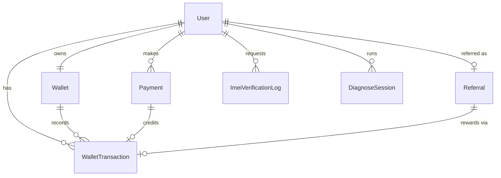
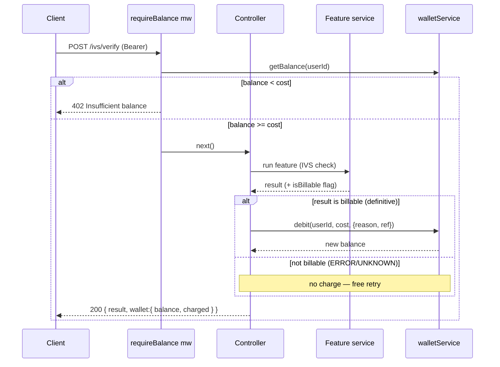
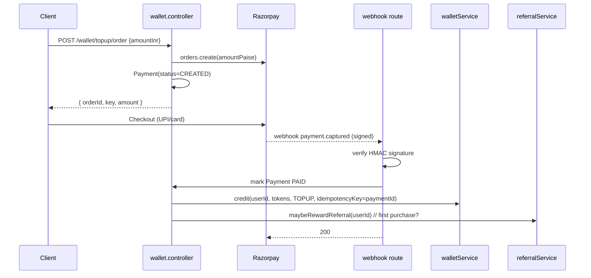

# Token Wallet, Feature Billing & Referral — Architecture Design

> Status: **Design / proposed** · Author: architecture · Fits the existing
> MVC + service + provider layout (`routes → controllers → services →
> providers/models`). Nothing here breaks existing Auth / KYC / IVS code.

## 1. Product model

The app is **customer-facing** and **pay-per-feature**. A customer:

1. Logs in (Mobile + OTP) — *exists today*.
2. Buys **tokens** (prepaid wallet top-up via Razorpay).
3. Spends tokens on features: **IVS check = 20 tokens**, **Diagnose = 50 tokens**.
4. Can **refer** friends and earn bonus tokens.

### Locked decisions

| Decision | Choice |
|---|---|
| Token ↔ money | **1 token = ₹1**. Prices live in tokens; a ₹100 top-up credits 100 tokens. |
| When to charge | **Only on a definitive result.** IVS charges only when C-DOT returns `CLEAN/BLOCKED/STOLEN`. `ERROR`/`UNKNOWN` = no charge, free retry. |
| Referral payout | **On the referee's first token purchase.** Referrer **+20**, referee **+10** (welcome). Paid once per referee. |
| Payment gateway | **Razorpay** (order → checkout → webhook → credit). |

All amounts above are config, not hardcoded (see §7).

---

## 2. Core principle — the ledger is the source of truth

**Never treat a mutable `balance` counter as the truth.** The truth is an
**append-only ledger** (`WalletTransaction`). `Wallet.balance` is a *cached
running total* that must always be reconcilable by summing the ledger.

Every balance change is: **(1)** an atomic wallet update **and** **(2)** a
ledger row — written together so they can never diverge. Two safety rails:

- **Atomic conditional debit** — `findOneAndUpdate({ userId, balance: { $gte: cost } }, { $inc: { balance: -cost } })`. This is atomic at the document level, so it **prevents double-spend and negative balances** even under concurrent requests.
- **Idempotency keys** — every credit/debit can carry a unique `idempotencyKey`. Razorpay webhooks and referral payouts are idempotent, so a replayed webhook credits tokens **exactly once**.

> **MongoDB note:** to make the wallet update + ledger insert truly atomic,
> run Mongo as a **replica set** and wrap them in a session transaction
> (`session.withTransaction`). On a single node without transactions, do the
> atomic conditional `$inc` first, then insert the ledger row; a nightly
> reconciliation job re-sums the ledger and flags drift. **Replica set +
> transactions is the recommendation.**

---

## 3. Data models (new collections)

### 3.1 `Wallet` — one per user
```
userId          ObjectId  (unique, ref User)
balance         Number    (integer tokens, >= 0, default 0)
totalPurchased  Number    (lifetime tokens bought)
totalBonus      Number    (lifetime referral/welcome tokens)
totalSpent      Number    (lifetime tokens spent on features)
timestamps
```

### 3.2 `WalletTransaction` — the append-only ledger
```
walletId        ObjectId  (ref Wallet)
userId          ObjectId  (ref User, indexed)
type            enum: CREDIT | DEBIT
reason          enum: TOPUP | FEATURE_CHARGE | REFERRAL_BONUS
                      | WELCOME_BONUS | REFUND | ADJUSTMENT
amount          Number    (positive integer, always)
balanceBefore   Number    (snapshot for audit)
balanceAfter    Number    (snapshot for audit)
status          enum: COMPLETED | REVERSED   (default COMPLETED)
referenceType   enum: PAYMENT | IVS_CHECK | DIAGNOSE | REFERRAL | null
referenceId     ObjectId  (polymorphic link, nullable)
idempotencyKey  String    (unique, sparse)   ← dedupes webhooks/retries
metadata        Mixed
createdAt
```
Index: `{ userId: 1, createdAt: -1 }` for the statement view;
`{ idempotencyKey: 1 }` unique sparse.

### 3.3 `Payment` — a Razorpay top-up order
```
userId              ObjectId (ref User)
razorpayOrderId     String   (unique)
razorpayPaymentId   String   (set after capture)
razorpaySignature   String
amountPaise         Number   (INR in paise — Razorpay's unit)
tokens              Number   (tokens to credit on success)
status              enum: CREATED | PAID | FAILED | REFUNDED
creditTxnId         ObjectId (ref WalletTransaction, set on credit)
timestamps
```

### 3.4 `Referral` — one per referred user
```
referrerId      ObjectId (ref User, indexed)
refereeId       ObjectId (ref User, unique)   ← one referral per new user
code            String   (the referrer's code that was used)
status          enum: PENDING | REWARDED
rewardTxnId     ObjectId (ref WalletTransaction, set on payout)
rewardedAt      Date
timestamps
```

### 3.5 `User` — two additive fields (no breaking changes)
```
referralCode    String  (unique) — generated for every user at creation
referredBy      ObjectId (ref User, nullable) — who referred them
```

### 3.6 `DiagnoseSession` — the new paid feature (third-party backed)
Diagnose is run by an **external third-party service**, mirroring how IVS
calls C-DOT. It gets its own `providers/diagnoseProvider.js` behind a stable
internal interface, so the third-party can be swapped without touching the
service/controller. The provider follows the same rules as `cdotIvsProvider`:
**never hard-fail** on expected errors (not configured / auth / service down)
— return an `ERROR/UNKNOWN` status so the feature stays free on failure and
the customer can retry.
```
userId          ObjectId (ref User)
input           Mixed    (request payload sent to the third party)
providerRefId   String   (third-party reference/job id)
resultStatus    enum: SUCCESS | ERROR | UNKNOWN   (drives billability)
result          Mixed    (normalized third-party response)
rawResponse     Mixed    (raw third-party payload, for audit)
chargeTxnId     ObjectId (ref WalletTransaction, set only if billed)
status          enum: COMPLETED | FAILED
timestamps
```

### ER overview


---

## 4. The billing pattern — how every paid feature is gated

One reusable flow, so IVS, Diagnose, and any future paid feature charge
**identically**. Because we charge *only on a definitive result*, the shape is
**authorize → execute → settle**:



- **Authorize** (`requireBalance(featureKey)` middleware): reject with **402
  Payment Required** *before* running the feature if `balance < cost`.
- **Execute**: run the feature.
- **Settle**: the service decides `isBillable` and calls
  `walletService.debit` with an atomic conditional `$inc`. If a concurrent
  request drained the wallet between authorize and settle, the conditional
  debit fails safely → return the result but mark `charged: false` (rare; log
  it). For zero-risk correctness under heavy concurrency, upgrade to
  **reserve-then-settle** (hold on authorize, commit/release on settle) — the
  ledger already supports it via `status`.

**Billable rule for IVS:** billable ⟺ `imei1Status ∈ {CLEAN, BLOCKED, STOLEN}`
(and if `imei2` given, it's also definitive). `ERROR`/`UNKNOWN` → not billable.
This piggybacks on the existing provider, which already returns those exact
statuses and never throws.

**Diagnose:** billable ⟺ the third-party returned a **successful diagnosis**
(`resultStatus === SUCCESS`). If the third-party errors, times out, or is
unconfigured (`ERROR/UNKNOWN`), **no charge, free retry** — same contract as
IVS. The `diagnoseProvider` normalizes the third-party's response into
`{ resultStatus, result, rawResponse, providerRefId }` so the billing rule
never depends on the third-party's raw shape.

---

## 5. Top-up flow (Razorpay)



**Security rules (non-negotiable):**
- **Tokens are credited only from the server-verified webhook**, never from
  the client's success callback. The client callback may *optimistically*
  refresh the balance, but the webhook is the source of truth.
- Verify the **HMAC signature** on every webhook with the Razorpay **webhook
  secret**; reject mismatches. The webhook route reads the **raw body** (add a
  raw-body parser only on that path — `express.json()` would break signature
  verification).
- Idempotency: `idempotencyKey = razorpayPaymentId`. A duplicate webhook hits
  the unique index and is a no-op.

Optional `POST /wallet/topup/verify` (client sends `orderId + paymentId +
signature`) as a fast-path confirmation, but it must converge with the webhook
and never double-credit (same idempotency key).

---

## 6. Referral flow

1. **Code generation:** every user gets a unique `referralCode` at creation
   (short base36/random, retry on collision) — extend `findOrCreateUserByMobile`.
2. **Code capture:** `verify-otp` accepts an optional `referralCode`. When a
   **new** user is created with a valid code (not their own, code exists),
   set `referredBy` and create a `Referral(status=PENDING)`. Ignore for
   existing users (a referral only counts for brand-new signups).
3. **Payout:** inside the webhook credit path, after a successful **first**
   TOPUP, `referralService.maybeRewardReferral(refereeId)`:
   - find `Referral{ refereeId, status: PENDING }`; if none, stop.
   - credit **referrer +20** (`REFERRAL_BONUS`) and **referee +10**
     (`WELCOME_BONUS`), mark `Referral REWARDED`.
   - idempotencyKey `referral:{refereeId}` → paid exactly once.

**Anti-abuse guards:** no self-referral; reward requires a *real paid* top-up
(not bonus tokens); one referral per referee (unique index); code only binds
at first signup.

---

## 7. Pricing & config

Start with a constants file (fast, versioned); move to a `Pricing` collection
later if you want to edit prices without a deploy.

`src/constants/pricing.js`
```js
module.exports = Object.freeze({
  FEATURES: { IVS_CHECK: 20, DIAGNOSE: 50 },        // tokens
  REFERRAL: { REFERRER_BONUS: 20, REFEREE_WELCOME: 10 },
  TOKEN_PER_INR: 1,
});
```
Expose `GET /pricing` so the client renders live prices/costs before a user
acts (avoid hardcoding ₹20/₹50 in the app).

New env vars: `RAZORPAY_KEY_ID`, `RAZORPAY_KEY_SECRET`,
`RAZORPAY_WEBHOOK_SECRET`. Follow the existing "refuse to boot if missing"
pattern in `config/env.js`.

---

## 8. New API surface (all under `/api/v1`)

### Wallet
| Method | Endpoint | Auth | Purpose |
|---|---|---|---|
| GET | `/wallet` | Yes | Balance + lifetime stats |
| GET | `/wallet/transactions` | Yes | Paginated ledger (statement) |
| POST | `/wallet/topup/order` | Yes | Create Razorpay order |
| POST | `/wallet/topup/verify` | Yes | Optional client-side confirm |
| POST | `/wallet/webhook/razorpay` | **No** (signed) | Credit tokens (source of truth) |

### Referral
| Method | Endpoint | Auth | Purpose |
|---|---|---|---|
| GET | `/referral` | Yes | My code, share link, earnings, invitee count |

### Pricing
| Method | Endpoint | Auth | Purpose |
|---|---|---|---|
| GET | `/pricing` | Yes | Feature costs + referral rewards |

### Diagnose (new paid feature)
| Method | Endpoint | Auth | Charge |
|---|---|---|---|
| POST | `/diagnose` | Yes | 50 tokens on success |

### IVS (existing — now billed)
`POST /ivs/verify` gains `requireBalance('IVS_CHECK')` preflight and charges 20
tokens only on a definitive result. Response gains `wallet: { balance, charged }`.

---

## 9. Files to add (mirrors existing structure)

```
src/
  models/        Wallet.model.js  WalletTransaction.model.js
                 Payment.model.js  Referral.model.js  DiagnoseSession.model.js
  services/      wallet.service.js  payment.service.js
                 referral.service.js  diagnose.service.js
  services/providers/  razorpayProvider.js  diagnoseProvider.js
                       (like cdotIvsProvider/aadhaarProvider)
  controllers/   wallet.controller.js  referral.controller.js  diagnose.controller.js
  routes/        wallet.routes.js  referral.routes.js  diagnose.routes.js
  validators/    wallet.validator.js  diagnose.validator.js
  middleware/    requireBalance.middleware.js
  constants/     pricing.js   (+ new reasons/enums in messages.js)
```
Wire the new routers in `routes/index.js`; add the raw-body webhook path in
`app.js` **before** `express.json()`.

---

## 10. Edge cases the implementation must handle

| Case | Handling |
|---|---|
| Double-spend / concurrent debits | Atomic conditional `$inc` with `balance >= cost` guard. |
| Insufficient balance | 402 in `requireBalance`, feature never runs. |
| Webhook replay / duplicate | Unique `idempotencyKey` (payment id) → no-op. |
| Client callback fires but webhook doesn't | Webhook is truth; `/topup/verify` reconciles; unpaid `Payment` stays `CREATED`. |
| Feature succeeds but debit fails (race) | Return result, `charged:false`, log for reconciliation (or use reserve-then-settle). |
| IVS service down (`ERROR`/`UNKNOWN`) | Not billable — no deduction, free retry. |
| Refund needed | `REFUND` credit ledger row linked to original debit; Payment→REFUNDED. |
| Self / repeat / fake referral | Guards in §6; unique referee index; payout gated on real purchase. |
| Ledger vs. balance drift | Nightly reconciliation summing ledger per wallet. |

---

## 11. Suggested build order

1. `Wallet` + `WalletTransaction` + `walletService` (credit/debit + idempotency) — the foundation.
2. `GET /wallet`, `GET /wallet/transactions`.
3. Razorpay top-up: `Payment`, `razorpayProvider`, order + webhook, credit.
4. `requireBalance` middleware + wire IVS billing (definitive-result rule).
5. Diagnose module (gated, 50 tokens).
6. Referral: code gen at signup, capture at verify-otp, payout on first purchase.
7. `Pricing` endpoint + Swagger annotations + Postman entries.
```
```
